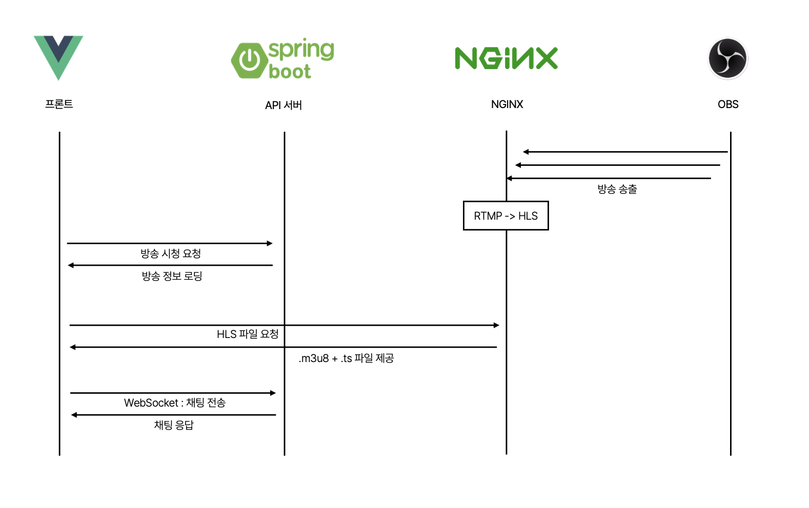

## 라이브 스트리밍 서비스

RTMP 방식으로 라이브 스트리밍을 송출할 수 있는 서비스입니다.
OBS 를 통해 실시간 방송을 송출할 수 있습니다.

## 기본 개념 

사용자가 OBS프로그램을 통해 방송을 하기 위해 만든 개인 스트리밍 시스템입니다.  
방송을 송출하기 위해 RTMP 방식을 사용하며, 방송을 시청하기 위해 HLS(HTTP Live Streaming) 방식을 사용합니다.   

## 서버 구성 

- Nginx(rtmp, media)
    - RTMP 방식으로 방송 영상을 수신하고 HLS 방식으로 방송을 변환하여 저장합니다.
    - 방송 화면을 캡쳐하여 썸네일로 저장합니다. 
    - 저장된 미디어를 제공합니다.
    - [nginx.conf](infra/rtmp/nginx.conf)

- API 서버
    - 방송 타이틀, 설명등을 관리합니다.
    - 사용자가 방송을 시청하기 위한 api를 제공합니다.
    - 채팅을 위한 api를 제공합니다.

- front-end
    - 사용자가 방송을 시청하고 채팅을 할 수 있는 화면입니다.
    - 방송 목록을 보여주고, 방송을 시청할 수 있습니다.

## 구현

### 송출
1. rtmp 프로토콜을 지원하는 방송 송출 프로그램을 사용하여 방송을 송출합니다. 
2. nginx-rtmp 모듈을 통해 방송을 수신합니다.
3. 수신된 방송을 hls 방식(.m3u8, .ts)으로 변환하여 저장합니다. (ffmpeg 사용)  
파일은 `/{username}.m3u8`, `/{username}/{seq}.ts` 형식으로 저장됩니다.
4. 방송 화면을 캡쳐하여 썸네일로 저장합니다.
5. nginx를 통해 저장된 미디어 파일을 제공합니다.

### 시청
1. 사용자는 A유저의 방송을 시청합니다.
2. API서버를 통해 A유저의 방송 정보 + 현재 방송상태를 가져옵니다.
3. 미디어 서버의 A유저 HLS 미디어를 요청합니다.

## 시연 화면 

라이브 방송 목록   
  

실시간 방송 시청   
  
